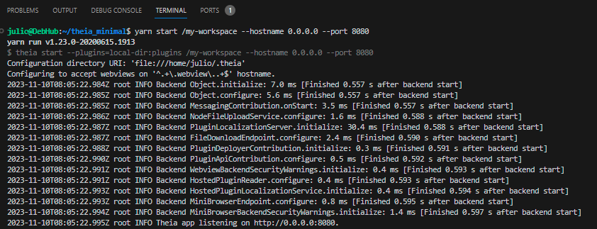

# theia_minimal
the minimal version of eclipse theia with just the necessary for use

This file contains tips to help you take (and understand) your first steps in
the world of Theia development. 

# How to build Theia minimal applications

The following instructions are for Linux and macOS.

## Prerequisites

 - Node.js `>= 18.17.0` and `< 21`.
   - If you are interested in Theia's VS Code Extension support then you should use a Node version at least compatible with the one included in the version of Electron used by [VS Code](https://github.com/microsoft/vscode).
 - [Yarn package manager](https://yarnpkg.com/en/docs/install)  `>= 1.7.0` **AND** `< 2.x.x`.
 - git (If you would like to use the Git-extension too, you will need to have git version 2.11.0 or higher.)
 - Python3 is required for the build due to [`node-gyp@8.4.1`](https://github.com/nodejs/node-gyp/tree/v8.4.1#installation)

Some additional tools and libraries are needed depending on your platform:

- Linux
  - [make](https://www.gnu.org/software/make/)
  - [gcc](https://gcc.gnu.org/) (or another compiling toolchain)
  - [pkg-config](https://www.freedesktop.org/wiki/Software/pkg-config/)
  - build-essential: `sudo apt-get install build-essential`
  <a name="prerequisite_native_keymap"></a>
  - [`native-keymap`](#prerequisite_native_keymap) native node module dependencies:
    - Debian-based: `sudo apt-get install libx11-dev libxkbfile-dev`
    - Red Hat-based: `sudo yum install libX11-devel.x86_64 libxkbfile-devel.x86_64 # or .i686`
    - FreeBSD: `sudo pkg install libX11`
  <a name="prerequisite_keytar"></a>
  - [`keytar`](#prerequisite_keytar) native node module dependencies ([reference](https://github.com/atom/node-keytar#on-linux)):
    - Debian/Ubuntu: `sudo apt-get install libsecret-1-dev`
    - Red Hat-based: `sudo yum install libsecret-devel`
    - Arch Linux: `sudo pacman -S libsecret`
    - Alpine: `apk add libsecret-dev`

- Linux/MacOS
  - [nvm](https://github.com/nvm-sh/nvm) is recommended to easily switch between Node.js versions.

- Windows
  - We recommend using [`scoop`](https://scoop.sh/). The detailed steps are [here](#building-on-windows).


## Clone the repository

```sh
git clone https://github.com/insightahead/theia_minimal.git
```

## Building

First, install all dependencies.

```sh
cd theia_minimal
yarn
```
Second, use Theia CLI to build the application.

```sh
yarn theia build
```

`yarn` looks up `theia` executable provided by `@theia/cli` in the context of our application and then executes the `build` command with `theia`. This can take a while since the application is built in production mode by default, i.e. obfuscated and minified.

## Running
After the build is finished, we can start the application:

```sh
yarn theia start --plugins=local-dir:plugins
```

or rely on the `start` script from `package.json`:

```sh
yarn start
```

You can provide a workspace path to open as a first argument and `--hostname`, `--port` options to deploy the application on specific network interfaces and ports, e.g. to open `/workspace` on all interfaces and port `8080`:

```sh
yarn start /my-workspace --hostname 0.0.0.0 --port 8080
```
In the terminal, you should see that Theia application is up and listening:


